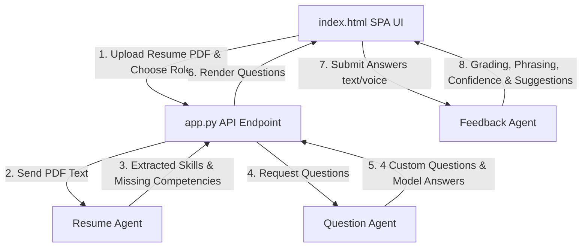

# 🌌 PrepFlow AI: Multi-Agent Mock Interview Arena

PrepFlow AI is an ultra-premium, full-stack **AI-Powered Interview Preparation Arena** built using Python, Flask, and an interactive, glassmorphic HTML5/JS single-page application. The platform leverages a coordinated swarm of specialized AI agents to guide candidates from raw resume analysis to a real-time, timed voice interview and deep semantic grading.

---

## 🚀 Key Features

*   **📄 Intelligent Resume PDF Analyzer**: Drag-and-drop your resume PDF to trigger the **Resume Analyzer Agent**. It extracts your tech stack, key projects, core strengths, and dynamically computes critical "missing skills" relative to your target role.
*   **🎙️ Interactive Voice Interviewing (Speech-to-Text)**: Natively integrated with the browser Web Speech API. Click the mic icon, and speak your answer directly—the app transcribes your speech in real-time, creating a realistic, high-pressure mock interview feel.
*   **⏱️ Active Circular Timer**: Built-in visual countdown timer (120 seconds per question) to simulate real technical screening pressure.
*   **🤖 Coordinated Multi-Agent Backend**:
    *   **Resume Agent**: Extracts skills and builds the candidate's professional matrix (AI + smart regex scanner fallback).
    *   **Question Agent**: Tailors a custom 4-question screen path (2 Technical, 1 Project Scenario, and 1 HR/Behavioral) targeting your specific projects and missing topics.
    *   **Feedback Agent**: Evaluates response correctness, judges phrasing confidence, assigns grades (1 to 10), and compiles suggested senior-developer answers.
*   **🔌 Dual-Mode (AI + High-Fidelity Simulation Fallback)**:
    *   *AI-Powered Mode*: Hooks up automatically if a Google Gemini (`GEMINI_API_KEY`) or OpenAI (`OPENAI_API_KEY`) environment key is found.
    *   *Robust Offline Fallback*: Runs perfectly out-of-the-box using advanced string distance metric scorers and keyword banks if no keys are set.
*   **✨ Ultra-Premium Glassmorphism UI**: obsidian dark mode, slowly floating organic blur backdrops, glowing neon borders, circular radial gauges, and dynamic report downloading.

---

## 📁 Repository Structure

```text
prepflow-ai/
│
├── app.py                      # Flask Application Controller & Route Handlers
├── requirements.txt            # Package Dependencies
├── utils.py                    # PDF parser, LLM connectors & Fallback Scorer/Database
│
├── agents/                     # Multi-Agent Package
│   ├── __init__.py             # Entrypoint exposures
│   ├── resume_agent.py         # Resume Profile Extractor Agent (AI + Rule-based)
│   ├── question_agent.py       # Custom Prompt Question Generator Agent
│   └── feedback_agent.py       # Response Evaluator & Grade Agent
│
├── templates/
│   └── index.html              # Core Premium SPA Client (HTML5, Vanilla CSS, JS)
│
└── README.md                   # Project Documentation
```

---

## 🛠️ Installation & Setup

### 1. Clone the Repository
```bash
git clone https://github.com/ajil212390/prepflow-ai.git
cd prepflow-ai
```

### 2. Install Dependencies
```bash
pip install -r requirements.txt
```

### 3. Set up API Keys (Optional but Recommended)
PrepFlow AI automatically detects keys in the environment. Set one of the following before running:

*   **Google Gemini API**:
    ```powershell
    # Windows PowerShell
    $env:GEMINI_API_KEY="your_gemini_api_key"
    ```
    ```bash
    # Linux/macOS
    export GEMINI_API_KEY="your_gemini_api_key"
    ```
*   **OpenAI API**:
    ```powershell
    # Windows PowerShell
    $env:OPENAI_API_KEY="your_openai_api_key"
    ```
    ```bash
    # Linux/macOS
    export OPENAI_API_KEY="your_openai_api_key"
    ```

*If no key is configured, the application runs using our high-fidelity local database and rule-based scorer, ensuring a full demo is available instantly!*

### 4. Run the Application
Launch the Flask development server:
```bash
python app.py
```

Then open your browser and navigate to:
```text
http://localhost:5000
```

---

## 🧬 Multi-Agent Orchestration Flow



---

## 📝 License
This project is licensed under the MIT License. See the LICENSE file for details.
